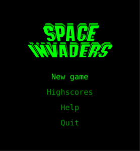
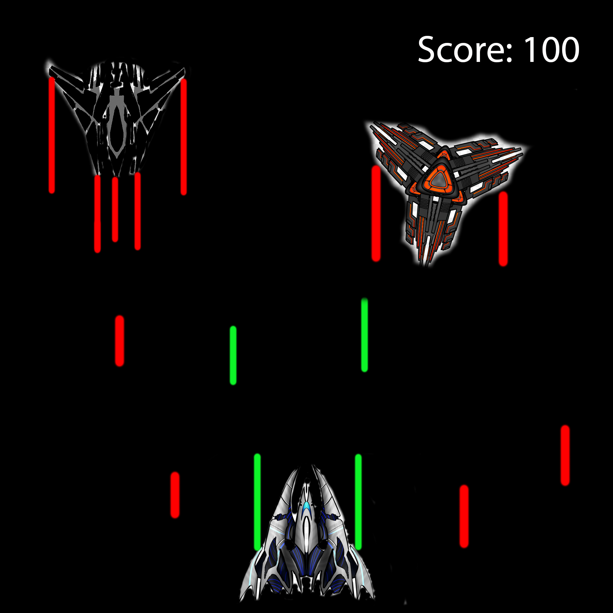
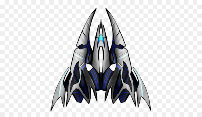
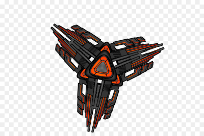
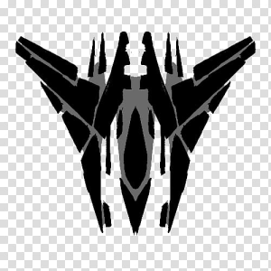
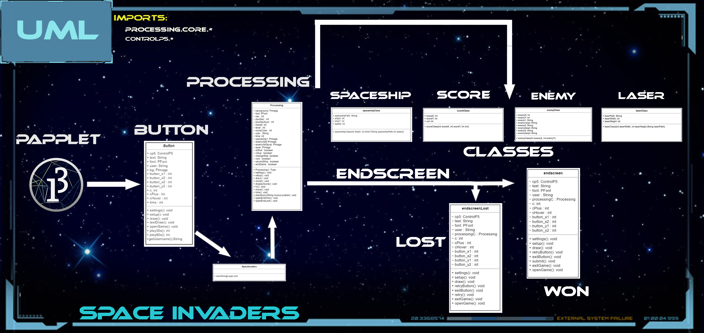

# Space Inavader

## Description

Our version of Space Invaders will be a reimagination of the arcade classic realised in Java. 
We take the simple gameplay formula of defending your base against an army of approaching 
alien spacecrafts and modernise it with new faster and smother gameplay, weapon upgrades, diverse 
and challenging enemy types and a brand new local multiplayer.

## Weapon Upgrades

*    fast shot -> doubles shooting speed
*    wide shot -> doubles shooting hitboxes
*    double shot -> doubles projectiles

## Enemys

standard

* Officer - faster/ double health
* Captain - quadruple health/ irregular movement

## Intention
We are working on this project to challenge our self with reimagining this classic in java. 
The solid singe player mode will be supported with a semi competitive Coop mode in which the players 
work together to defeat de alien threat but also will be able to compare their scores.

|   |   |
|---|---|
| Game type  | Top Down Shooter    |
| Language | Java         |
| Goal      |Defeat all enemy’s Graphic | 
| interface | Processing           |
| IDEA                 |     IntelliJ and Netbeans |

to-do

1. Menu
2. Interface / background / Score ...
3. enemies 
4. Player
5. bullets
6. multiplayer       

