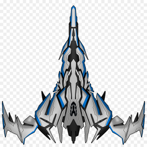

# Space Inavader

## Description

Our version of Space Invaders will be a reimagination of the acrade classic realised in Java.
We take the simple gameplay formula of defending your base against an army of aproching alien spacecrafts and modernise it with new faster and smother gameplay,
weapon uprgades, diverse and challenging enemy types and a brand new lokal multiplayer.

## Weapon Upgrades

* fast shot -> doubles shoting speed
* wide shot -> doubles shoting hitboxs
* double shot ->doubles projectiles

//graphik

## Enemys

standard

* Officer - faster/ double health
* Captain - quadruple health/ iregular movment

// graphik

## Intetion
We are working on this projekt to challenge ourself with reimagining this classic in java.
The solid singelplayer mode will be suported with a semi competetiv CooP mode in which the players work together to defeat de alien threat but also will be able to compare theyr scores.

|   |   |  
|---|---|
| Gametype  | Top Down Shoter    |
| Language  | Java         |
| Goal      |Defeat all enemysGraphik 
| interface |  Processing           |
| IDEA                 | 	IntelliJ and Netbeans |

to-do

1. Menue
2. Interface / background / Score ...
3. enemies 
4. Player
5. bullets
6. multiplayer       
